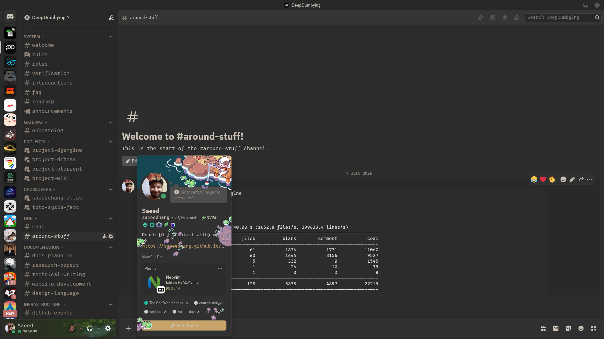

# Onyx Minimal

A warm-gold, minimal dark theme for Discord — soft rounded corners (never sharp), one unified typeface across the whole client, and no boxy borders. Panes and windows are told apart only by subtle elevation, not by outlines.

- **Palette:** neutral charcoal surfaces with a warm gold accent
- **Shape:** small consistent radius everywhere, avatars stay circular
- **Type:** a single font family for chat, sidebar, and code — [`0xProto Nerd Font`](https://github.com/0xProto/0xProto) if installed locally, falling back to Inter
- **Surfaces:** no borders on embeds, reactions, or code blocks — separation comes from background elevation only

Compatible with **BetterDiscord** and **Vencord / Vesktop**.

## Preview



## Installation

### BetterDiscord

1. Download [`OnyxMinimal.theme.css`](./OnyxMinimal.theme.css).
2. Open Discord → **Settings → BetterDiscord → Themes**.
3. Click **Open Themes Folder** and drop the file in.
4. Enable **Onyx Minimal** in the Themes list.

### Vesktop / Vencord

1. Download [`OnyxMinimal.theme.css`](./OnyxMinimal.theme.css).
2. Open Discord/Vesktop → **Settings → Vencord → Themes**.
3. Click **Open Themes Folder** and drop the file in.
4. Enable **Onyx Minimal** in the Themes tab (make sure "Enable Themes" is on).

You can also load it remotely instead of downloading, by pasting this into the **Online Themes** field in the Themes tab:

```
https://raw.githubusercontent.com/saeeedhany/onyx-minimal/main/OnyxMinimal.theme.css
```

## Notes

- Requires Discord's built-in **Dark Mode** to be enabled — the theme builds on top of it.
- For the intended look, install the [`0xProto Nerd Font`](https://github.com/0xProto/0xProto) on your system. Without it, the theme automatically falls back to Inter.

## License

[MIT](./LICENSE) © Saeed Hany
